# T-Sport — Full Stack Sports E-commerce Platform

## 📌 Description
T-Sport is a full-stack e-commerce web application for sports products, built with a React frontend and Node.js/Express backend.

This project demonstrates my ability to design and develop a real-world fullstack system, including user features, admin management, and RESTful APIs.

## 🧩 Key Features

### 🛒 Client Side
- Product browsing and category filtering
- Product details, search, and reviews
- Shopping cart and checkout flow

### 🛠️ Admin Panel
- CRUD management for products, categories, orders, and users
- Order status updates and system control

### 🔐 Authentication
- User registration and login
- Protected admin routes

## 🛠️ Tech Stack

- **Frontend:** React (Client & Admin UI)
- **Backend:** Node.js + Express
- **Database:** MySQL
- **API:** RESTful API with middleware
- **Styling:** Tailwind CSS

## 📂 Project Structure
```bash
T_Sport/
├─ assets/                       # Images and static assets (demo images for README)
│  ├─ home.png
│  ├─ dashboard.png
│  └─ ...
├─ fe_tsport/                     # Client storefront app
│  ├─ src/
│  │  ├─ Admin/                   # Admin-specific features
│  │  ├─ Checkout/                # Checkout flow
│  │  ├─ component/               # Shared UI components
│  │  ├─ Layout/                  # Layout components
│  │  ├─ ProductDetails/          # Product details page
│  │  ├─ Products/                # Product listing
│  │  ├─ ShoppingCart/            # Cart logic
│  │  ├─ css/                     # Styles
│  │  └─ index.js
│  ├─ public/
│  ├─ build/
│  ├─ package.json
│  └─ tailwind.config.js
├─ be_tsport/                     # Backend API server
│  ├─ config/                     # Application configuration
│  │  └─ ...
│  ├─ routes/                     # API route definitions
│  │  └─ ...
│  ├─ services/                   # Business logic and service layer
│  │  └─ ...
│  ├─ app.js                      # Express application configuration
│  ├─ server.js                   # Server entrypoint
│  ├─ connect.js                  # Database connection
│  ├─ authMiddleware.js           # Authentication middleware
│  ├─ package.json
│  └─ ...
└─ README.md
```
---

## 🛠️ Setup
1. Install dependencies for each app:
   - `cd be_tsport && npm install`
   - `cd fe_tsport && npm install`
2. Start backend: `cd be_tsport && npm run dev`
3. Start frontend(s): `cd fe_tsport && npm start`

## 📸 Screenshots
### Client UI
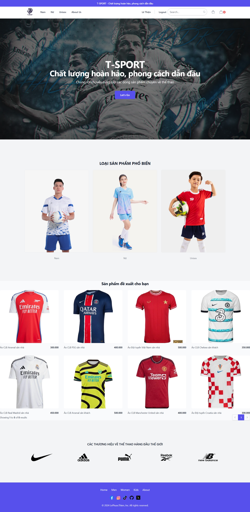
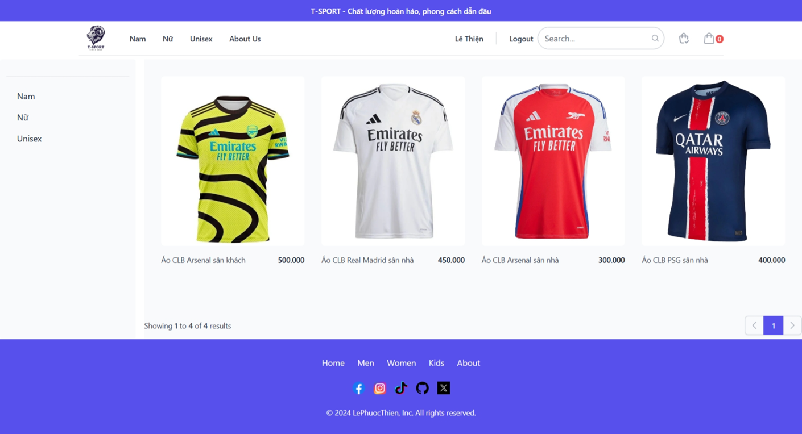
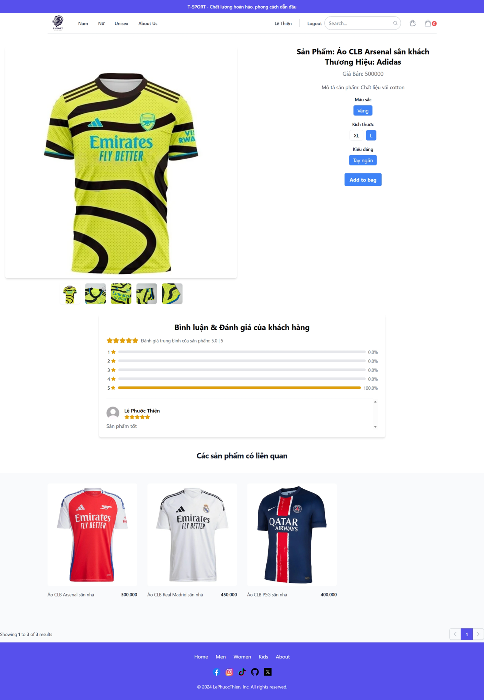
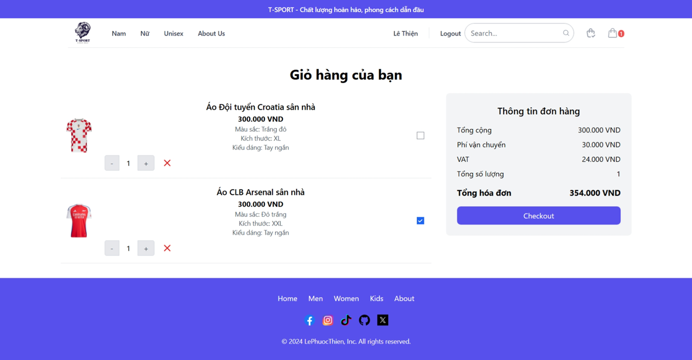
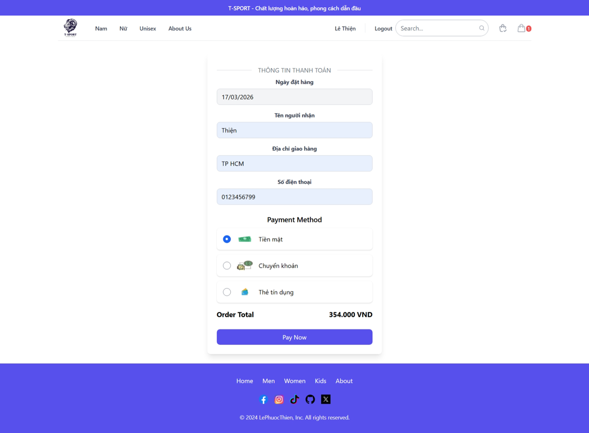
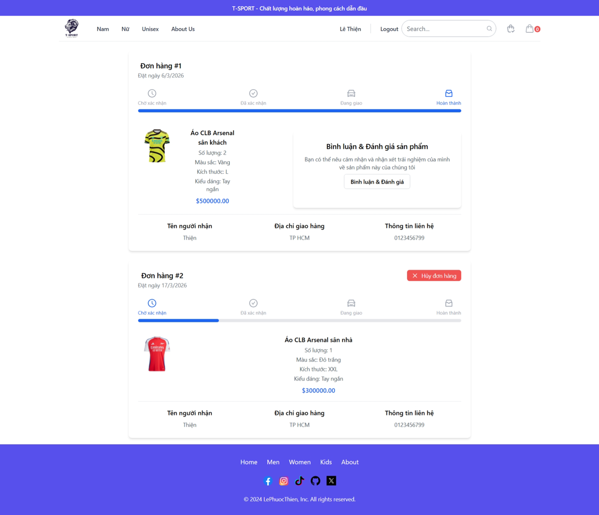

### Admin Dashboard
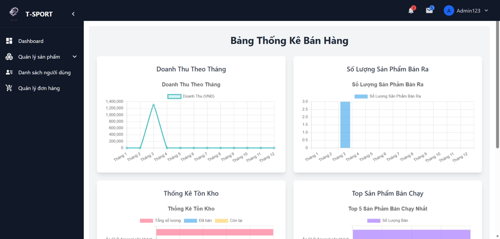
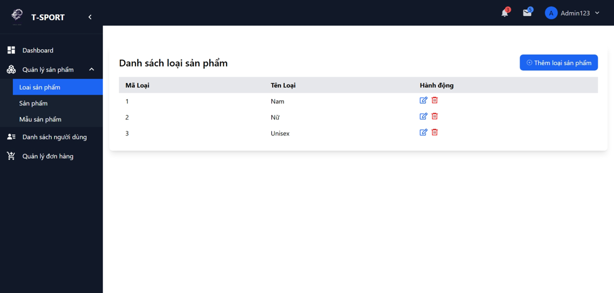
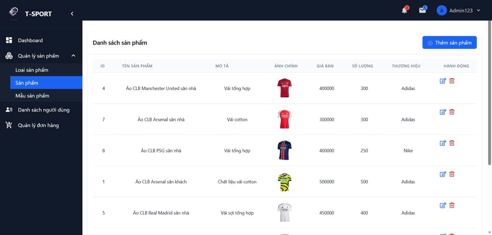
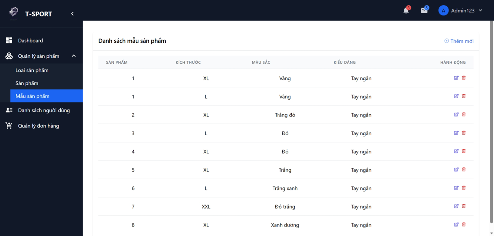
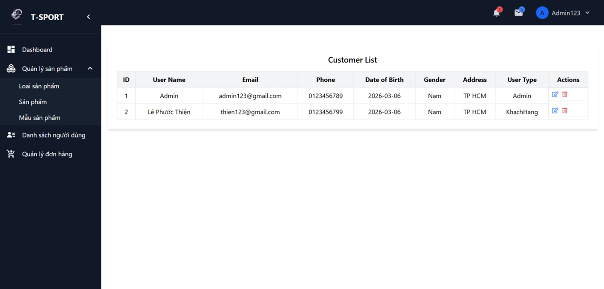
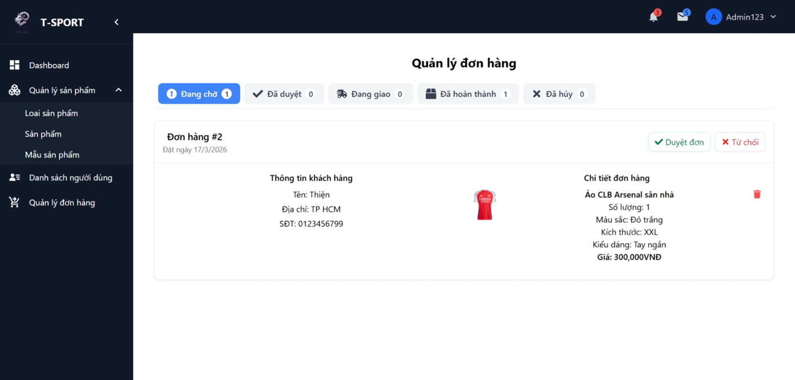
